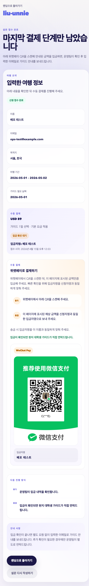

# 刘Unnie

중국인 관광객을 위한 현지 대학생 가이드 매칭 MVP입니다.  
현재는 설문 제출 후 `WeChat Pay` 수동 입금 안내로 이어지고, 운영팀이 입금을 확인한 뒤 가이드가 직접 연락하는 흐름으로 구성되어 있습니다.

## Live

- Production: `https://liu-unnie.com`
- Survey: `https://liu-unnie.com/survey?lang=ko`
- Completion example: `https://liu-unnie.com/survey/complete?id=653381b1-0e16-4736-a6bf-9d9bfd8ab180&lang=ko`

## Current Flow

1. 사용자가 다국어 설문을 작성합니다.
2. 서버에 설문이 저장되고 운영팀에게 제출 알림 메일이 발송됩니다.
3. 완료 페이지에서 `WeChat Pay` QR과 입금자명 안내를 확인합니다.
4. 운영팀이 입금을 확인한 뒤 현지 대학생 가이드가 직접 연락합니다.

## Screenshot

프로덕션 완료 페이지 기준 캡처입니다.



## What Works

- `ko / zh / en` 언어 전환
- Supabase 기반 설문 저장
- 가이드 날짜 기반 동적 견적 계산
- 완료 페이지 `WeChat Pay` 수동 결제 안내
- 설문 제출 시 운영팀 알림 메일 발송
- 프로덕션 배포 완료

## Stack

- Next.js
- React
- Supabase
- Resend
- Vercel

## Local Dev

```bash
npm install
npm run dev
```

## Build

```bash
npm run build
```

## Notes

- 현재 결제 UX는 `PayPal`이 아니라 `WeChat Pay` 수동 입금 기준입니다.
- 이전 `main` 상태는 원격 브랜치 `legacy-main`으로 보존되어 있습니다.
- 다음 우선순위 작업은 `수동 입금 확인을 쉽게 하는 운영용 어드민 페이지`입니다.
